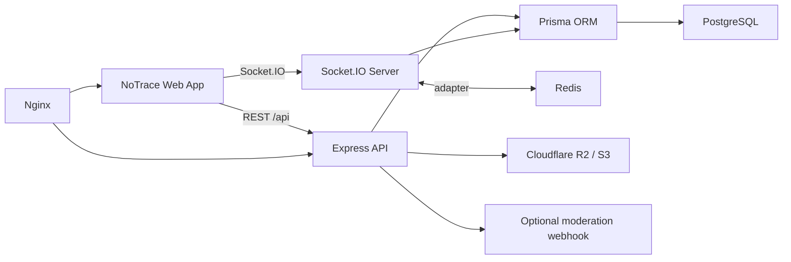

# NoTrace Architecture

NoTrace is an invite-only anonymous community chat platform. The system is split into a Next.js web app and an Express/Socket.IO API, backed by PostgreSQL, Prisma, Redis, and S3-compatible object storage.

## Project Layout

```text
apps/
  api/
    prisma/schema.prisma       Database schema
    src/index.ts               Express + Socket.IO server entrypoint
    src/routes/                REST API routes
    src/realtime.ts            Socket.IO events
    src/services/              Auth, storage, retention, moderation, messages
    src/jobs/retention.ts      Expiring-message cleanup
  web/
    app/                       Next.js App Router
    components/                NoTrace chat, admin, and UI components
    hooks/use-socket.ts        Socket.IO client hook
    lib/                       API helpers, sample state, types
docs/
nginx/
docker-compose.yml
```

## Runtime Flow



## Privacy Model

NoTrace does not model real names, email addresses, phone numbers, IP addresses, or device identifiers as user-facing identity. Members receive random anonymous names and avatar seeds. Membership aliases are group-scoped, so the same account can appear differently across communities.

Join requests and magic links use one-time tokens. Raw invite codes and approval tokens are shown only at creation time; the database stores HMAC hashes.

## Scalability Model

- Socket.IO is ready for horizontal scale through the Redis adapter.
- Message history and moderation data live in PostgreSQL with indexed group/channel/time queries.
- Media uploads use presigned S3-compatible URLs so API instances do not proxy large files.
- Nginx forwards WebSocket upgrades and strips forwarded IP exposure from upstream headers by default.
- Expiring messages are swept by a background job; in large deployments, run that job as one worker instance or convert it to a scheduled task.

## E2EE Roadmap

The schema includes `publicKey` and group `e2eeMode` flags. A production E2EE mode should add device keys, per-channel symmetric keys, sender-key rotation, encrypted message payloads, and verified key fingerprints. Until that is implemented, NoTrace should be described as privacy-preserving, not end-to-end encrypted.
