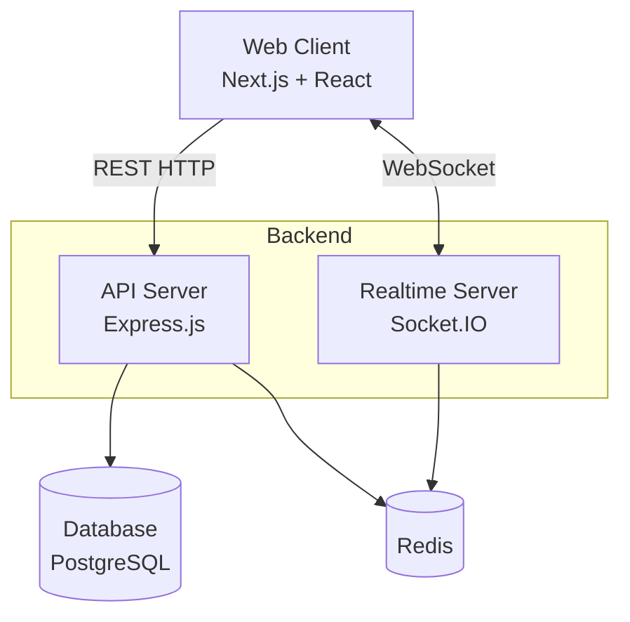

# Architecture Overview

NoTrace is built as a modern full-stack monorepo, separating the frontend web client from the backend API while sharing types where necessary.

## System Diagram

## Repository Structure

The project uses a monorepo setup (managed via `pnpm` workspaces):

- `apps/web/`: The frontend Next.js application.
- `apps/api/`: The backend Express + Socket.IO server.

---

## Backend (`apps/api`)

The backend is a Node.js application using Express for REST endpoints and Socket.IO for real-time bidirectional communication.

### Core Technologies
- **Express.js**: Handles standard HTTP requests (authentication, creating groups, fetching message history).
- **Socket.IO**: Handles real-time events (new messages, typing indicators, presence).
- **Prisma**: The Object-Relational Mapper (ORM) used to interact with PostgreSQL.
- **PostgreSQL**: The primary database storing groups, users, and persistent messages.
- **Redis**: Used for two purposes:
  1. **Socket.IO Adapter**: Allows scaling the backend horizontally across multiple nodes while keeping WebSocket channels synchronized.
  2. **Rate Limiting / Caching**: Fast ephemeral storage for API limits.

### Directory Structure
- `src/routes/`: Express route handlers (REST API).
- `src/services/`: Core business logic (database queries, auth token generation).
- `src/realtime.ts`: Socket.IO event handlers and middleware.
- `prisma/`: Database schema and migration files.

---

## Frontend (`apps/web`)

The frontend is a React application built on the Next.js App Router.

### Core Technologies
- **Next.js (App Router)**: React framework for routing, layout, and rendering.
- **Tailwind CSS**: Utility-first CSS framework for styling.
- **Radix UI / shadcn-style**: Unstyled, accessible UI components.
- **Zustand / React Context**: State management for active chats and identities.
- **PWA**: Configured as a Progressive Web App (manifest, service worker) for mobile installation.

### Directory Structure
- `app/`: Next.js file-based routing (`/` home, `/join` invite link handler).
- `components/`: Reusable UI components.
  - `chat/`: Messaging UI, input composers, ephemeral views.
  - `dashboard/`: Admin and group management panels.
  - `ui/`: Shared primitive components (buttons, dialogs, inputs).
- `public/`: Static assets, PWA icons, and manifest.

---

## Data Flow: Sending a Message

1. **User types a message** in the `apps/web` client.
2. The client emits a `send_message` event via **Socket.IO**.
3. The `apps/api` server receives the event, validates the user's session token, and checks if they belong to the target group.
4. The API saves the message to **PostgreSQL** via Prisma.
5. The API broadcasts the `new_message` event to the specific Socket.IO room (representing the group).
6. All connected clients in that group receive the event and update their UI instantly.
